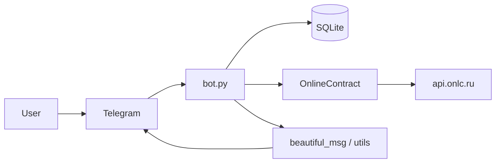

# Telegram-бот OnlineContract

## 1. Краткое описание проекта

Telegram-бот на **aiogram 3.x** показывает пользователю открытые торговые процедуры и конкурсные листы с площадки [onlinecontract.ru](https://onlinecontract.ru) через публичный API `api.onlc.ru`. Пользователь выбирает категорию, получает карточки процедур с пагинацией и по кнопке может открыть позиции (конкурсный лист) по выбранной процедуре.

## 2. Стек технологий

| Область | Технологии |
|--------|------------|
| Язык | Python **3.10–3.12** (рекомендуется для стабильных wheels у aiogram/aiohttp) |
| Telegram | **aiogram** 3.x, HTML parse mode |
| HTTP к API площадки | **requests** (вызовы из asyncio через `asyncio.to_thread`) |
| БД | **SQLite**, **SQLAlchemy** 2.x (async), **aiosqlite**, **Pydantic** 2.x |
| Миграции | **Alembic** (схема поднимается при старте через `init_db_schema`) |

Зависимости: [`requirements.txt`](requirements.txt). Для разработки и тестов дополнительно: [`requirements-dev.txt`](requirements-dev.txt).

## 3. Архитектура решения

**Вкратце:** `bot.py` — точка входа: `Dispatcher`, middleware с одной сессией БД на update, обработчики команд и callback. Ответы API кэшируются в SQLite; тексты карточек формируются в `utils/` (в т.ч. `beautiful_msg`). Клиент к `api.onlc.ru` — класс `OnlineContract` в `fetch_modules/online_trade.py`.

Подробнее: [`docs/architecture.md`](docs/architecture.md), схема БД: [`docs/database.md`](docs/database.md).

### Схема потока данных



## 4. Инструкция по запуску

1. Клонируйте репозиторий и перейдите в корень проекта.

2. Создайте виртуальное окружение (по желанию) и установите зависимости:

   ```bash
   python3 -m venv .venv
   source .venv/bin/activate   # Windows: .venv\Scripts\activate
   pip install -r requirements.txt
   ```

3. Задайте токен бота от [@BotFather](https://t.me/BotFather). Удобно скопировать [`example.env`](example.env) в `.env` и заполнить `TOKEN`, либо экспортировать переменные:

   ```bash
   export TOKEN="ваш_токен"
   ```

4. Опционально укажите `DATABASE_URL` для файловой БД (по умолчанию — in-memory; см. комментарии в [`example.env`](example.env)).

5. Запустите бота из корня репозитория:

   ```bash
   python bot.py
   ```

## 5. Инструкция по тестированию

### Автотесты (pytest)

Установите dev-зависимости и запустите тесты:

```bash
pip install -r requirements.txt -r requirements-dev.txt
pytest
```

Каталог тестов: [`tests/`](tests/). Для импорта `bot` нужен `TOKEN` в окружении; в [`tests/conftest.py`](tests/conftest.py) для pytest задаётся тестовый placeholder. Настройки: [`pytest.ini`](pytest.ini).

Покрытие по файлам см. [`docs/testing.md`](docs/testing.md).

### Ручная проверка в Telegram

1. Запустите бота с реальным `TOKEN` (`python bot.py`).
2. В чате: `/start` — кнопки категорий; выбор категории — карточки; при большом списке — «Показать ещё»; кнопка позиций — конкурсный лист (при длинном тексте возможно несколько сообщений).
3. При недоступности API бот должен отвечать сообщением об ошибке, а не падать.

---

Дополнительно: конфигурация и секреты — [`docs/misc.md`](docs/misc.md); план работ — [`plans/README.md`](plans/README.md).
