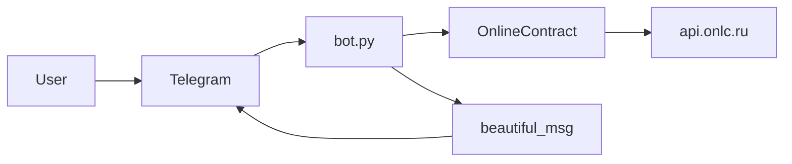

# Архитектура приложения

Достоверное описание потоков и границ компонентов. Детали реализации — в исходниках и в профильных файлах [`docs/`](.).

## Назначение

Telegram-бот на **aiogram 2.x** запрашивает у публичного API **onlinecontract.ru** (`api.onlc.ru`) список открытых процедур по выбранным категориям и отдаёт пользователю карточки; по кнопке загружает позиции (конкурсный лист) по процедуре.

## Внешние источники и ограничения

| Источник | Для чего смотреть |
|----------|-------------------|
| [Telegram Bot API](https://core.telegram.org/bots/api) | Лимиты сообщений (4096 символов), callback_data (до 64 байт), flood control |
| [aiogram 2.x](https://docs.aiogram.dev/en/v2.25.1/) | Обработчики, `Bot`, `Dispatcher`, `executor`, HTML parse mode |
| Код [`fetch_modules/online_trade.py`](../fetch_modules/online_trade.py) | Фактические URL и query к `api.onlc.ru` (публичная спецификация площадки в репозитории не хранится) |

## Структура репозитория (логические слои)

```text
bot.py              — точка входа, маршрутизация update → handlers, кэш списков процедур
fetch_modules/      — синхронный HTTP-клиент к API (вызов из asyncio через to_thread)
misc/               — загрузка TOKEN (TgKeys)
utils/              — форматирование текста для Telegram, конфиг категорий для клавиатуры
```

Персистентного хранилища нет. Кэш **`_procedure_lists_cache`** живёт в памяти процесса и сбрасывается на **`/start`**.

## Поток данных



1. Пользователь выбирает категорию → `callback_data` из [`utils/categories.py`](../utils/categories.py) → [`_ensure_procedures`](../bot.py) → `OnlineContract.get_procedures` (в `to_thread`).
2. Карточки процедур рендерятся через `beautiful_procedure`; пагинация — callback вида `m|<offset>|<cat_str>` (см. [`bot.py`](../bot.py)).
3. «Позиции» → `pos_<id>` → `get_positions` → `beautiful_positions`; длинный текст режется через `split_telegram_messages`.

## Согласованность данных

- Кнопки категорий: кортеж **`onlc_text_and_data`** и множество **`CATEGORY_CALLBACK_IDS`** в [`bot.py`](../bot.py) должны совпадать по вторым элементам (строка id для API).

## Пакеты (углублённо)

- HTTP и модель ответов API: [`fetch_modules.md`](fetch_modules.md)
- TOKEN: [`misc.md`](misc.md)
- Тексты и HTML: [`utils.md`](utils.md)
